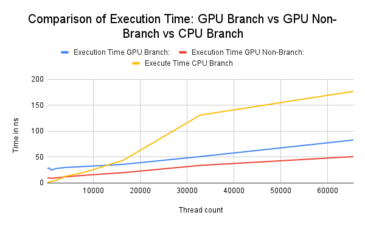

# Module 3 Assignment - Frederich Stine

## Arithmetic Cuda implementations

To implement the four required arithmetic operations I created four different kernels in the same assignment.cu file.
These operators are called based on the third command line argument passed to the file.

0 - Add  
1 - Sub  
2 - Mult  
3 - Mod  

More information on how to run this properly can be seen in the provided **run.sh** script.

The first two command line arguments are *number of threads* and *block size*. Full output on how to run this can be seen by 
executing the assignment executable without any arguments.

```
Call ./assignment {numThreads} {blockSize} {operation}
Operations:
    0: Add
    1: Sub
    2: Mult
    3: Mod
    4: Branch Compare
```

A full output of the run.sh script is included in [documentation/run.log](documentation/run.log), and as such I will not include the output in this README.

## Conditional Branch Cuda implementation

To test the effects of conditional branching I created some code to time a kernel that included a lot of conditional branching.
I compared this kernel to a kernel that did not include conditional branching as well as the same conditional algorithm running in series on the CPU.
When timing I ran into a few issues. Since the kernel execution is asynchronous, the timing needs to end after the memory is copied back off the GPU to the CPU.
I did not see as big of a contrast between the conditional branching kernel and both the normal CPU code and non-branching kernel as I expected.
I have though of a couple of possiblities as to why this is.

1. The compiler was able to optimize the branches out of my kernel - unable to confirm this
2. The dataset was not large enough to indicate a large enough change in execution time.
3. The GPU driver was able to optimize these instructions.

Even though I did not see as large of a change as I anticipated, the GPU was still slower executing the conditional kernel than the non conditional kernel.
The CPU was faster for small amounts of kernels, but when I made this number very large the GPU was still able to finish the calculations faster.



Here we can see that the difference between the conditional branching kernel is longer than the non-branching kernel, but not by an exponential amount.
This is why my thoughts above were necessary on this example. If this is not the intended outcome I would love some example code to better replicate the behavior.

## Stretch Problem 

I'm going to briefly discuss some good things and some areas of improvement for this submission.

Good elements:
1. This code allows for user input of numbers of blocks and threads
2. This code uses a good timing mechanism (chrono) to time the add kernel and the add host code.
3. This code properly allocates and runs the kernel.

Areas for improvement:
1. While this code allows for a variable number of blocks/threads passed to the kernel, the full functionality is not implemented. I am unsure of what N is set to in this example, but the size of the data that needs to be processed does not change. This can allow for some issues if the blocks/threads provided is larger than the memory allocated on the device.
2. While the method of timing is accurate, only the asynchronous dispatch of the kernel is timed. This is static from my testing and does not actually measure the execution time of the kernel. The timer needs to stop after a blocking operating such as the cudaMemcpy from DeviceToHost.
3. With the fixed N value, this is likely not enough data to really quantify the performance inprovement of the parallel processor on the GPU.
4. It seems threads here is block size rather than overall threads to be executed.
5. addHost function does not seem to account for overall quantity of threads.

If this code was only run one time it would not result in meaningful data due to the areas of improvement highlighted above. If the goal is to time the difference between performing an add on the host versus on the GPU this program does not achieve that. This could be partially fixed by inputting different blocks/threads through the command line arguments, but this is also not properly utilized. I am unsure of how addHost works, but it does not seem to use the blocks/threads variables as they are not in scope of that function. This means that even the comparison is across differently sized datasets. To generate some more accurate data on the difference in performance all of these issues would need to be resolved and this program would need to be profiled with varying quantity of overall threads (not threads as used here) multiple times.
