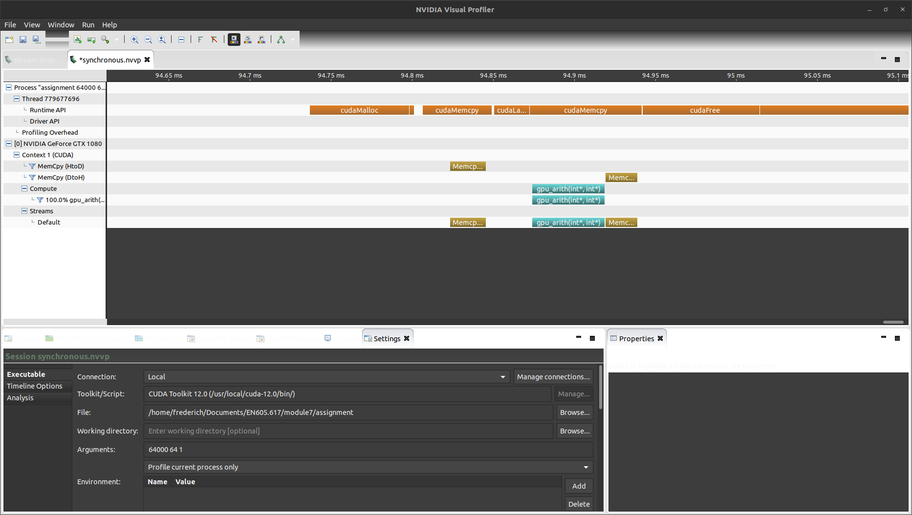
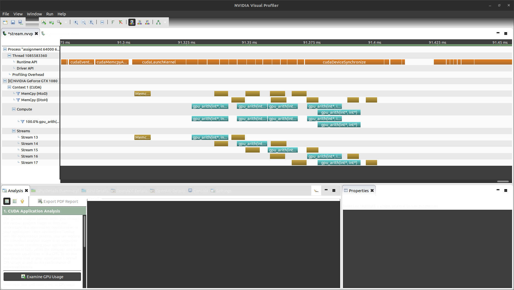

# Module 7 - Frederich Stine

## CUDA Streams

To demonstrate the usefulness of asynchronous cuda streams I created two ways of calling the same kernel.

- One that uses a variable size of asynchronous streams
- One that uses the default synchronous stream

I compared these ways of calling the kernels across different data sizes and profilers.

The kernel that I chose to use is that same as the register arithmetic kernel from module 6. I reduced the amount of 
iterations that the kernel makes. I did this because the main speedful from using asynchronous streams comes from 
the reduction of time taken when copying data from the device to gpu and gpu to device.

My program allows for a variable size of threads and block size. When using the streaming function this program 
also allows for a variable size of streams. One requirement here is that the amount of blocks need to be divisible 
by the number of streams. This is just due to how I split up the work, it is possible to do this with non divisible 
sizes but I did not implement this functionality.

As with previous assignments, all of the functionality is in one *assignment.cu* file. Different functions are 
invoked from the command lne arguments. The help menu is below:

```
Call ./assignment {threadCount} {blockSize} {operation} {numStreams for op 0}
Operations: 
    0: Stream example
    1: Synchronous example
```

I also created a *run.sh* script that uses nvprof as well as the built in timing to time different elements of the program.
Due to the asynchronous nature, nvprof is not as useful here. I used built in timing to see the overall time, 
but I also used the visual nvidia profiler (nvpp) to show the scheduling of my streams. The fulle log of the *run.sh* 
script is available in [documentation/full_run.log](documentation/full_run.log).

Here is some of the output that shows the speedup. I had some different runs that can be viewed in the full_run file. 
With very small amounts of data there is no speedup and some slowdown because the time saved copying data is less 
than the time spent launching new kernels. The data that I am showing below is a case where a speedup can be seen.

```
Press enter to continue:
0: Streamed execution
Running 64000 threads with block size of 64 - 2 streams
==153470== NVPROF is profiling process 153470, command: ./assignment 64000 64 0 2
Time taken: 0.1099 ms
==153470== Profiling application: ./assignment 64000 64 0 2
==153470== Profiling result:
            Type  Time(%)      Time     Calls       Avg       Min       Max  Name
 GPU activities:   53.99%  52.385us         2  26.192us  24.736us  27.649us  gpu_arith(int*, int*)
                   24.57%  23.839us         2  11.919us  11.584us  12.255us  [CUDA memcpy HtoD]
                   21.44%  20.800us         2  10.400us  10.272us  10.528us  [CUDA memcpy DtoH]
      API calls:   98.83%  82.777ms         2  41.388ms  2.8150us  82.774ms  cudaMallocHost
                    0.39%  326.06us         2  163.03us  3.7570us  322.31us  cudaFreeHost
                    0.20%  171.35us       114  1.5030us     240ns  68.990us  cuDeviceGetAttribute
                    0.19%  159.49us         1  159.49us  159.49us  159.49us  cuLibraryLoadData
                    0.09%  74.039us         2  37.019us  4.8190us  69.220us  cudaFree
                    0.07%  56.417us         2  28.208us  1.8840us  54.533us  cudaMalloc
                    0.06%  51.316us         1  51.316us  51.316us  51.316us  cudaDeviceSynchronize
                    0.04%  33.543us         1  33.543us  33.543us  33.543us  cuDeviceGetName
                    0.03%  25.808us         2  12.904us  4.8290us  20.979us  cudaLaunchKernel
                    0.03%  24.605us         4  6.1510us  3.5760us  12.904us  cudaMemcpyAsync
                    0.02%  19.246us         2  9.6230us  1.6730us  17.573us  cudaStreamCreateWithFlags
                    0.01%  11.912us         2  5.9560us  1.8530us  10.059us  cudaEventRecord
                    0.01%  6.4920us         2  3.2460us  1.3920us  5.1000us  cudaStreamDestroy
                    0.01%  4.4880us         1  4.4880us  4.4880us  4.4880us  cudaEventSynchronize
                    0.01%  4.3180us         1  4.3180us  4.3180us  4.3180us  cuDeviceGetPCIBusId
                    0.00%  2.5950us         2  1.2970us     491ns  2.1040us  cudaEventCreate
                    0.00%  2.5050us         3     835ns     381ns  1.6530us  cuDeviceGetCount
                    0.00%  1.3730us         1  1.3730us  1.3730us  1.3730us  cudaEventElapsedTime
                    0.00%  1.1130us         2     556ns     311ns     802ns  cuDeviceGet
                    0.00%     531ns         1     531ns     531ns     531ns  cuModuleGetLoadingMode
                    0.00%     481ns         1     481ns     481ns     481ns  cuDeviceTotalMem
                    0.00%     371ns         1     371ns     371ns     371ns  cuDeviceGetUuid
Press enter to continue:
0: Streamed execution
Running 64000 threads with block size of 64 - 10 streams
==153483== NVPROF is profiling process 153483, command: ./assignment 64000 64 0 10
==153483== Time taken: 0.1606 ms
Profiling application: ./assignment 64000 64 0 10
==153483== Profiling result:
            Type  Time(%)      Time     Calls       Avg       Min       Max  Name
 GPU activities:   57.96%  94.847us        10  9.4840us  9.0550us  11.712us  gpu_arith(int*, int*)
                   23.02%  37.664us        10  3.7660us  3.1040us  4.5120us  [CUDA memcpy HtoD]
                   19.03%  31.137us        10  3.1130us  2.6560us  3.7440us  [CUDA memcpy DtoH]
      API calls:   98.85%  93.610ms         2  46.805ms  2.8560us  93.607ms  cudaMallocHost
                    0.34%  326.22us         2  163.11us  3.6170us  322.61us  cudaFreeHost
                    0.17%  163.95us       114  1.4380us     230ns  66.164us  cuDeviceGetAttribute
                    0.17%  157.56us         1  157.56us  157.56us  157.56us  cuLibraryLoadData
                    0.09%  85.510us        10  8.5510us  1.2930us  56.887us  cudaStreamCreateWithFlags
                    0.08%  74.229us         2  37.114us  4.6080us  69.621us  cudaFree
                    0.07%  65.386us        20  3.2690us  2.2540us  12.603us  cudaMemcpyAsync
                    0.06%  56.406us         2  28.203us  2.0540us  54.352us  cudaMalloc
                    0.05%  51.238us        10  5.1230us  2.9760us  19.286us  cudaLaunchKernel
                    0.03%  30.718us         1  30.718us  30.718us  30.718us  cudaDeviceSynchronize
                    0.03%  28.383us         1  28.383us  28.383us  28.383us  cuDeviceGetName
                    0.02%  16.440us        10  1.6440us  1.2720us  4.4890us  cudaStreamDestroy
                    0.01%  12.454us         2  6.2270us  2.0340us  10.420us  cudaEventRecord
                    0.01%  7.5940us         1  7.5940us  7.5940us  7.5940us  cuDeviceGetPCIBusId
                    0.00%  4.6280us         1  4.6280us  4.6280us  4.6280us  cudaEventSynchronize
                    0.00%  2.7260us         2  1.3630us     501ns  2.2250us  cudaEventCreate
                    0.00%  2.2850us         3     761ns     361ns  1.2930us  cuDeviceGetCount
                    0.00%  1.1820us         1  1.1820us  1.1820us  1.1820us  cudaEventElapsedTime
                    0.00%     801ns         2     400ns     250ns     551ns  cuDeviceGet
                    0.00%     611ns         1     611ns     611ns     611ns  cuDeviceTotalMem
                    0.00%     491ns         1     491ns     491ns     491ns  cuModuleGetLoadingMode
                    0.00%     330ns         1     330ns     330ns     330ns  cuDeviceGetUuid
Press enter to continue:0: Synchronous execution
Running 64000 threads with block size of 64
==153509== NVPROF is profiling process 153509, command: ./assignment 64000 64 1
Time taken: 0.1337 ms
==153509== Profiling application: ./assignment 64000 64 1
==153509== Profiling result:
            Type  Time(%)      Time     Calls       Avg       Min       Max  Name
 GPU activities:   53.26%  47.553us         1  47.553us  47.553us  47.553us  gpu_arith(int*, int*)
                   24.70%  22.048us         1  22.048us  22.048us  22.048us  [CUDA memcpy HtoD]
                   22.04%  19.680us         1  19.680us  19.680us  19.680us  [CUDA memcpy DtoH]
      API calls:   98.85%  85.114ms         2  42.557ms  2.8950us  85.111ms  cudaMallocHost
                    0.38%  322.94us         2  161.47us  3.2360us  319.70us  cudaFreeHost
                    0.21%  180.23us       114  1.5800us     230ns  68.199us  cuDeviceGetAttribute
                    0.19%  159.70us         1  159.70us  159.70us  159.70us  cuLibraryLoadData
                    0.13%  109.56us         2  54.778us  38.302us  71.254us  cudaMemcpy
                    0.09%  74.270us         2  37.135us  4.2780us  69.992us  cudaFree
                    0.07%  58.629us         2  29.314us  2.0430us  56.586us  cudaMalloc
                    0.03%  27.763us         1  27.763us  27.763us  27.763us  cuDeviceGetName
                    0.02%  18.405us         1  18.405us  18.405us  18.405us  cudaLaunchKernel
                    0.01%  11.331us         2  5.6650us  1.7030us  9.6280us  cudaEventRecord
                    0.01%  7.9050us         1  7.9050us  7.9050us  7.9050us  cuDeviceGetPCIBusId
                    0.01%  7.1930us         2  3.5960us     631ns  6.5620us  cudaEventCreate
                    0.00%  4.2680us         1  4.2680us  4.2680us  4.2680us  cudaEventSynchronize
                    0.00%  2.4050us         3     801ns     361ns  1.4930us  cuDeviceGetCount
                    0.00%  1.1320us         1  1.1320us  1.1320us  1.1320us  cudaEventElapsedTime
                    0.00%     913ns         2     456ns     321ns     592ns  cuDeviceGet
                    0.00%     471ns         1     471ns     471ns     471ns  cuModuleGetLoadingMode
                    0.00%     471ns         1     471ns     471ns     471ns  cuDeviceTotalMem
                    0.00%     371ns         1     371ns     371ns     371ns  cuDeviceGetUuid
```

Here with this example we can see that with 2 streams we see a speedup by reducing the amount of time spent copying data. 
When increasing this to 10 streams, we see some slowdown because launching all of the kernels adds some additional overhead 
that is larger than the time saved copying data.

This is hard to see from just the output from nvprof here. I additionally ran some visual Nvidia profiler runs to 
show exactly why this is happening. The configs that I used are available in [nvvp](nvvp).

### Synchronous profile


### Streams profile


### Differences
Here we can see that in the synchronous execution the data is copied, kernel is run, and data is copied back in order. 
In the streamed example this test used 5 streams. Once the data is copied for one stream it's execution starts and the data 
begins to be copied for the next stream. This pipelined approach can reduce the time spent copying data relative to the 
time that the kernel is executing which yields better utilization of the streaming multiprocessors on the GPU.

After completing this assignment I understand the userfulness of streams in CUDA. You need to have a good grasp of the 
data that you are dealing with to make an efficent use of the GPU. If your code is heavily dependent on copying memory 
utilizing multiple streams can be an efficent way to maximize utilization of the GPU. If copying memory is a very small 
portion of your programs runtime, this optimization may not create a large improvement.

## Stretch Problem

For the stretch problem I added in the solutions in the areas that needed finishing. I additionally added some more code to the function that 
printed out the device information as this was failing initially on my computer. 

Instead of keeping the `cudaStreamSynchronize(stream)` that was in the code I removed it for cudaDeviceSynchronize(). This example was synchronizing 
on a stream that was not being used. I am unsure of if this could cause issues, but seems like it was not intended. I also changed the timing to not 
include the host functionality to get a more accurate result.

This can be found at [stretch_problem.cu](stretch_problem.cu).

This can be compiled with the normal makefile and run.
